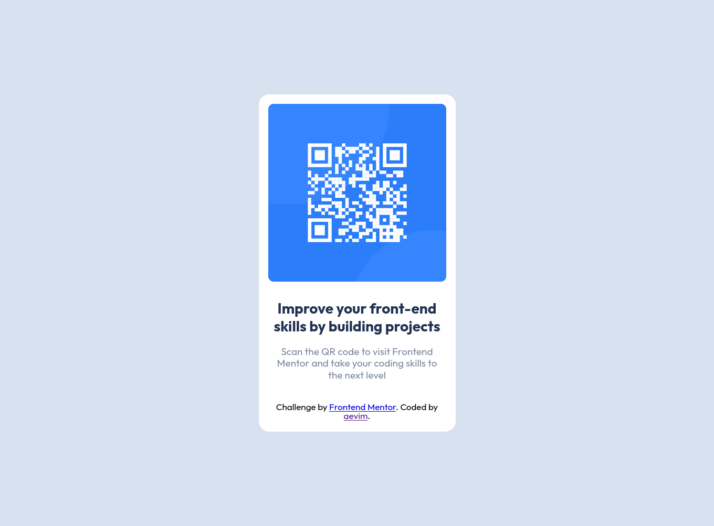

# Frontend Mentor - QR code component solution

This is a solution to the [QR code component challenge on Frontend Mentor](https://www.frontendmentor.io/challenges/qr-code-component-iux_sIO_H). Frontend Mentor challenges help you improve your coding skills by building realistic projects. 

## Table of contents

- [Overview](#overview)
  - [Screenshot](#screenshot)
  - [Links](#links)
- [My process](#my-process)
  - [Built with](#built-with)
  - [What I learned](#what-i-learned)
  - [Continued development](#continued-development)
  - [Useful resources](#useful-resources)
- [Author](#author)
- [Acknowledgments](#acknowledgments)

## Overview
The challenge was easy, but I was able to improve my sass knowledge. 

### Screenshot


### Links

- Solution URL: [Add solution URL here](https://your-solution-url.com)
- Live Site URL: [Add live site URL here](https://your-live-site-url.com)

## My process
I first started creating the project structure. I did a bit of search on how to properly
structure my sass files and, for a minimal web page, this was my favorite aprouch.
making a src/sass folder with a main.scss - for importing other files - and a partials
folder for all partials that I need. I also used BEM terminology for my html classes. 
It works really well with sass, for readabillity is great.

### Built with

- Semantic HTML5 markup
- Mobile-first workflow
- Sass
- BEM

### What I learned

I learn about a new tag in html, meta. It provides information about the site for
the browser and search engines.
I also learn about the media rule. It help me to do some changes for the layout when
is on a specific width.

```html
<meta name="descrition" "The description that will apear for search engines">
<meta name="author" "The developer's name"
```
```css
@media only screen and (min-width|max-width|: npx)
```
### Continued development

I'm not that conformatable with css-grid yet, so it's something I will be using for 
my next project.

### Useful resources

- [Sass structure](https://itnext.io/structuring-your-sass-projects-c8d41fa55ed4) - 
this help me with the sass file structure. I really liked this structure, at least for 
minimal web page, but I'm looking foward to try the other method for complex projects.

## Author

- Frontend Mentor - [@aevim](https://www.frontendmentor.io/profile/aevim)
